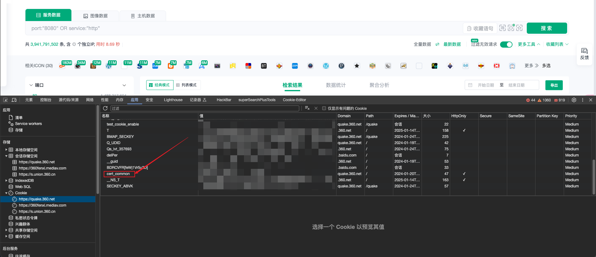

<h1 align="center">360QuakeSpider_GO版本</h1>
<p align="center">
    <a href="https://github.com/wanswu/360quakeSpider_GO/releases" />
    <a href="https://github.com/wanswu/360quakeSpider_GO/graphs/contributors" />
    <a href="https://github.com/wanswu/360quakeSpider_GO/releases/" />
    <a href="https://github.com/wanswu/360quakeSpider_GO/issues" />
</p>

---
<br>

> [!WARNING]
> 本工具仅供安全研究和学习使用。使用者需自行承担因使用此工具产生的所有法律及相关责任。请确保你的行为符合当地的法律和规定。作者不承担任何责任。如不接受，请勿使用此工具。

<br>

## 目前完成的功能：

- ✅ 1.数据存储（txt）
- ✅ 2.绕过1w条数据的限制（不太稳定）

# 使用方法
在[releases](https://github.com/wanswu/360quakeSpider_GO/releases)中下载对应系统版本

第一次执行会生成配置文件（config.yaml）
在quake的Cookie中找到`cert_common`的值，并粘贴至`config.yaml`中

```shell
./360quakeSpider_GO -cert '********-*******-*****-*******' -q '搜索语法' 
```

最后保存为`csv`文件，保存的格式为`URL,IP地址,ICP备案单位,ICP备案号,`，有域名的情况下优先保存域名。

# `PS：代码写的和屎一样，就不发了`

[](https://starchart.cc/wanswu/360quakeSpider_GO)
